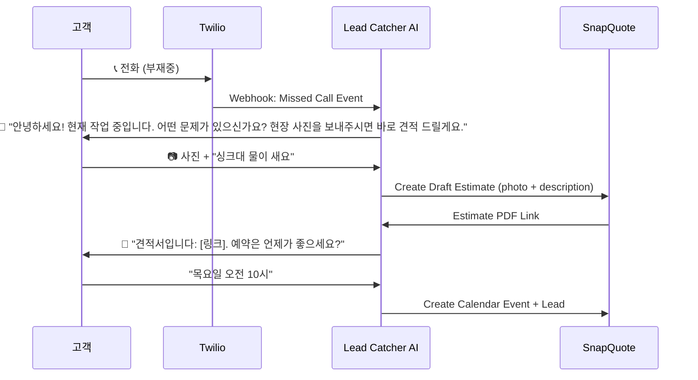

# SnapQuote "Lead Catcher" Feature Plan

> **목표:** 부재중 전화 → AI 자동 응대 → 사진 수집 → SnapQuote 견적 자동 생성 → 예약 확정

---

## 핵심 가치 제안

| Before (현재) | After (Lead Catcher) |
| :--- | :--- |
| 작업 중 전화 못받음 → 고객 이탈 | AI가 즉시 문자로 응대하여 고객 잡음 |
| 고객이 먼저 사진 안보내줌 | AI가 "사진 보내주세요" 유도 |
| 수동으로 견적 작성 | 사진 도착 → SnapQuote 자동 연동 |

---

## User Flow (고객 관점)

---

## 기능 명세

### Phase 1: MVP (4주)

| 기능 | 설명 | 우선순위 |
| :--- | :--- | :---: |
| **Missed Call Webhook** | Twilio에서 부재중 전화 감지 → 자동 문자 발송 | P0 |
| **Conversational AI** | GPT-4o로 자연스러운 문자 대화 (장황하지 않게, 간결하게) | P0 |
| **Photo Ingestion** | MMS로 받은 사진을 SnapQuote로 전달 | P0 |
| **Quick Quote Trigger** | 사진 + 설명 → SnapQuote API 호출 → 견적 생성 | P0 |
| **Lead Dashboard** | 신규 리드 목록 (이름, 전화번호, 상태, 견적 링크) | P1 |

### Phase 2: Growth (4주)

| 기능 | 설명 |
| :--- | :--- |
| **Calendar Sync** | "목요일 10시" → Google Calendar 자동 등록 |
| **Follow-up Automation** | 24시간 응답 없으면 "아직 궁금한 점 있으세요?" 재발송 |
| **Analytics** | 전환율 (부재중 → 견적 발송 → 예약 확정) 대시보드 |

---

## 기술 스택

| 영역 | 선택 | 이유 |
| :--- | :--- | :--- |
| **SMS/Voice** | Twilio | 북미 시장 표준, MMS 지원, Webhook 안정적 |
| **AI** | OpenAI GPT-4o | 짧은 문자 대화에 최적화, 저렴 |
| **Backend** | Next.js API Routes | SnapQuote와 동일 스택, 빠른 개발 |
| **Database** | Supabase (PostgreSQL) | SnapQuote 기존 DB 활용 |
| **Calendar** | Google Calendar API | 미국 Trades 업종 표준 |

---

## 데이터 모델 (신규 테이블)

### `leads` 테이블

| Column | Type | Description |
| :--- | :--- | :--- |
| `id` | UUID | PK |
| `user_id` | UUID | FK → users (SnapQuote 사용자) |
| `phone_number` | VARCHAR | 고객 전화번호 |
| `name` | VARCHAR | 고객 이름 (AI가 물어봄) |
| `status` | ENUM | `NEW`, `CONTACTED`, `QUOTED`, `SCHEDULED`, `CLOSED` |
| `conversation` | JSONB | 문자 대화 이력 |
| `estimate_id` | UUID | FK → estimates (생성된 견적) |
| `scheduled_at` | TIMESTAMP | 예약 일시 |
| `created_at` | TIMESTAMP | 리드 생성 시각 |

### `lead_messages` 테이블

| Column | Type | Description |
| :--- | :--- | :--- |
| `id` | UUID | PK |
| `lead_id` | UUID | FK → leads |
| `direction` | ENUM | `INBOUND`, `OUTBOUND` |
| `body` | TEXT | 메시지 본문 |
| `media_url` | VARCHAR | MMS 이미지 URL |
| `created_at` | TIMESTAMP | 메시지 시각 |

---

## API 엔드포인트 (신규)

| Endpoint | Method | Description |
| :--- | :--- | :--- |
| `/api/twilio/voice-webhook` | POST | 부재중 전화 감지 |
| `/api/twilio/sms-webhook` | POST | SMS/MMS 수신 처리 |
| `/api/leads` | GET | 리드 목록 조회 |
| `/api/leads/[id]` | GET | 리드 상세 조회 |
| `/api/leads/[id]/send-quote` | POST | 해당 리드에게 견적 발송 |

---

## 수익화 모델

| Tier | 가격 | 포함 내용 |
| :--- | :--- | :--- |
| **Free (SnapQuote Basic)** | $0 | 견적 생성만 가능 |
| **Pro** | $29/mo | Lead Catcher (월 100 리드) + Quick Quote |
| **Business** | $79/mo | 무제한 리드 + Calendar Sync + Analytics |

> **목표 MRR $3,000:** Pro 티어 103명 or Business 38명

---

## 마케팅 포지셔닝

**Before:** "사진 찍어서 견적 내는 앱"
**After:** "전화 안받아도 일감 잡아주는 AI 비서"

### 핵심 카피
> **"Never lose a lead again. AI answers your phone while you're on a ladder."**

---

## 리스크 & 해결책

| 리스크 | 영향 | 해결책 |
| :--- | :--- | :--- |
| Twilio 비용 | SMS 건당 $0.0079, MMS $0.02 | 월 100리드 = ~$5, 마진 충분 |
| AI 오작동 | 이상한 답변 보내면 신뢰 하락 | Few-shot prompting + 긴급 시 휴먼 핸드오프 |
| 포화 시장 | 유사 서비스 존재 (ServiceTitan, Jobber) | 가격 차별화 (대기업은 $200+/mo) |

---

## 검증 계획

### 기술 검증
1. Twilio Sandbox에서 Missed Call → SMS 발송 POC
2. GPT-4o로 3턴 대화 시뮬레이션
3. SnapQuote API로 Draft Estimate 생성 테스트

### 시장 검증
1. Reddit r/Plumbing, r/Electricians에 "Would you pay $29/mo for this?" 설문
2. 기존 SnapQuote 유저 5명에게 Feature Interview
